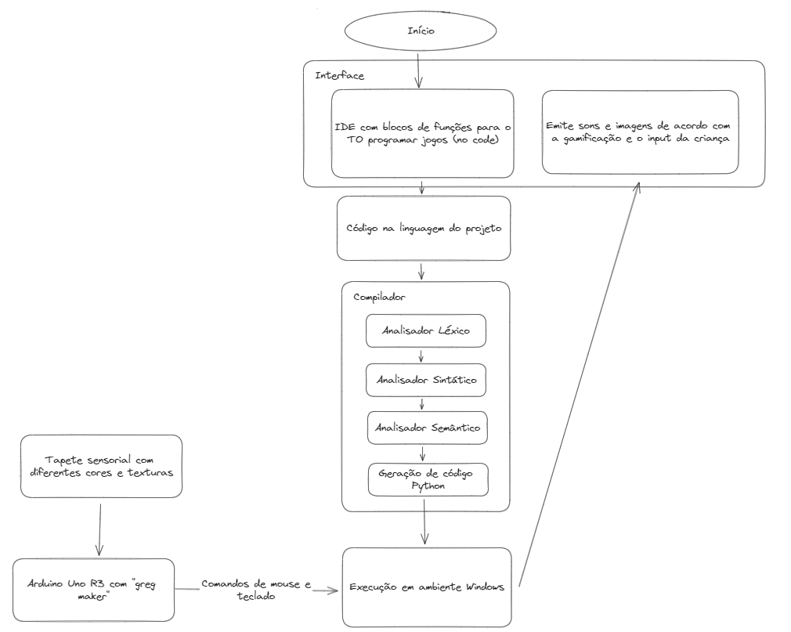

# Arquitetura do Sistema

## Principais funções
- Interface: A interface tem como função ser o componente no qual os usuários poderão interagir com a aplicação.
  - IDE: Componente em que o(a) Terapeuta Ocupacional poderá interagir para "programar" as funcionalidades dos jogos que serão realizados pelo(a) paciente. A ideia é que seja uma IDE no code, ou seja, só será necessário arrastar blocos representando cada quadrante do tapete, quantas vezes deverá ser apertado, e quais serão os feedbacks ao final da tarefa (qual será a imagem, o som ou o texto), sem saber qualquer lógica de programação.
  - Feedback: Parte da interface que irá emitir sons e mostrar imagens ou textos de acordo com o que foi programado na IDE e o comportamento do(a) paciente. Assim, servirá como reforço para mostrar se foi um acerto ou um erro.
- Código na linguagem do projeto: Os blocos programados na IDE serão convertidos em códigos na linguagem própria do projeto. Assim, poderá ser compilada pelo compilador.
- Compilador: Responsável por transformar a linguagem própria em um código Python executável. Ele é divido em algumas etapas:
  - Analisador léxico: Cria tokens que representam cada lexema do código-fonte com sua respectiva função e sua linha (ex: <"ASSIGN", "=", 1>), identificando todos os elementos da linguagem e se há algum lexema que não faz parte da linguagem. 
  - Analisador sintático: Usa recursão (pilha de chamadas de função) para analisar a estrutura do código e verificar se está em uma ordem lógica. Ao mesmo tempo, deve criar uma estrutura em árvore: a árvore sintática
  - Analisador semântico: Percorre a árvore sintática e identifica problemas impossíveis de detectar na etapa de análise sintática. Exemplos: variável usada não inicializada, compatibilidade de tipos, etc.
  - Gerador de código: Gera código Python capaz de ser executado.
- Ambiente Windows: Responsável por executar o código gerado pelo compilador, recebendo os comandos do "Greg Maker" e retornando os feedbacks para a Interface.
- "Greg Maker": transforma os toques manuais sobre objetos semicondutores e condutores em movimentos do mouse e algumas teclas do teclado, como barra de espaço, ENTER e setas. O responsável pela detecção dos toques manuais é o Arduino Uno R3, que converte a comunicação USB em comandos padronizados de mouse e teclado.
- Tapete sensorial: Principal meio de interação do(a) paciente com a aplicação através do toque. Por meio de fios de cobre em seus quadrantes, a interação do(a) paciente poderá ser mandada para o "Greg Maker" e convertida em comandos para o programa Python.

## Principais componentes de software
- Executável da IDE: Permite à terapeuta operacional (TO) desenvolver programas, de forma No-Code. Dentro da IDE, a TO pode criar uma conta pessoal, onde ela pode acessar ou cadastrar um ambiente específico para cada criança que está sob sua responsabilidade. Dentro do ambiente de uma criança, a terapeuta pode acessar um ambiente de desenvolvimento de tarefas, uma ficha técnica e um gráfico de desempenho.
  - **Ambiente de desenvolvimento de tarefas:** Nessa aba, a terapeuta tem acesso a todos os quadrantes do tapete sensorial, onde ela pode tratá-los como botões e programar uma atividade com base no que precisa ser trabalhado com a criança específica. Além dos quadrantes, ela pode programar como será o feedback positivo e negativo, adicionando imagens, sons baixados da internet ou sons que ela pode gravar externamente e fazer upload do arquivo.
  - **Perfil:** Já na aba Perfil, é onde as TO's podem ter acesso às informações das crianças, incluindo: nome, idade, grau, tipo de deficiência, data da primeira consulta, data da última consulta, interesses pessoais e a história.
  - **Gráfico de Desempenho:** A cada tarefa desenvolvida pelas crianças, elas podem acertar ou errar o que deve ser feito. Caso acertem, recebem um feedback positivo. No caso de erro, em vez de receber um feedback negativo que deixe claro e direto que erraram, recebem um feedback incentivando-as a continuar realizando as tarefas, em vez de desinteressá-las e fazê-las sentir que falharam.

