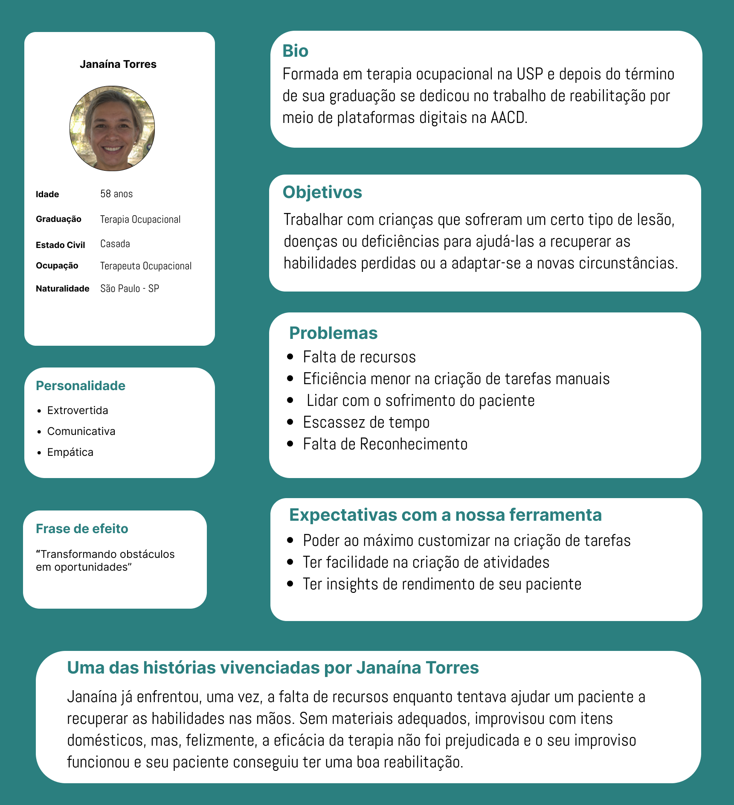
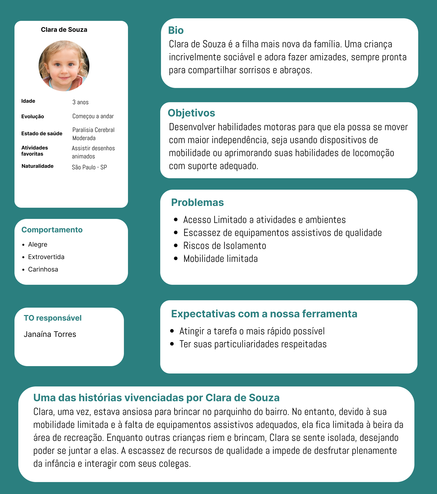
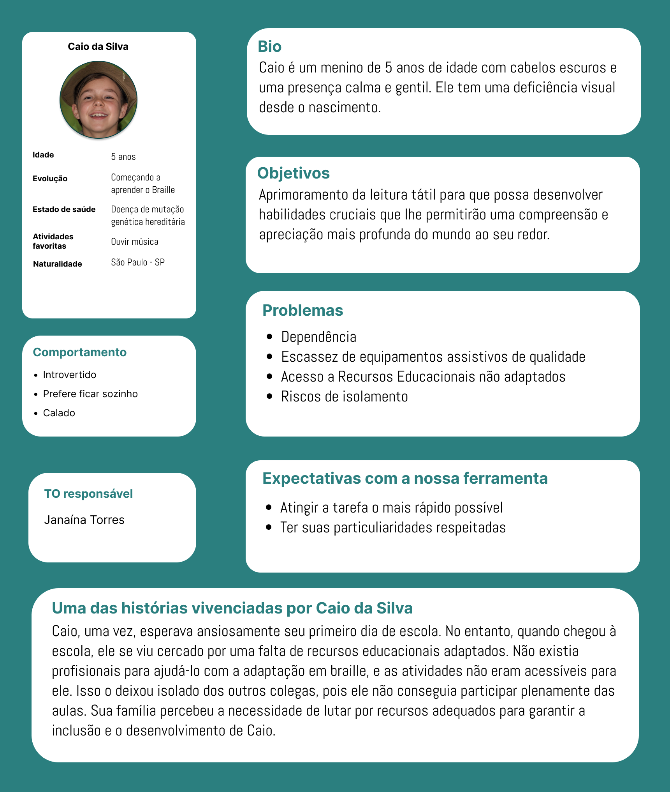
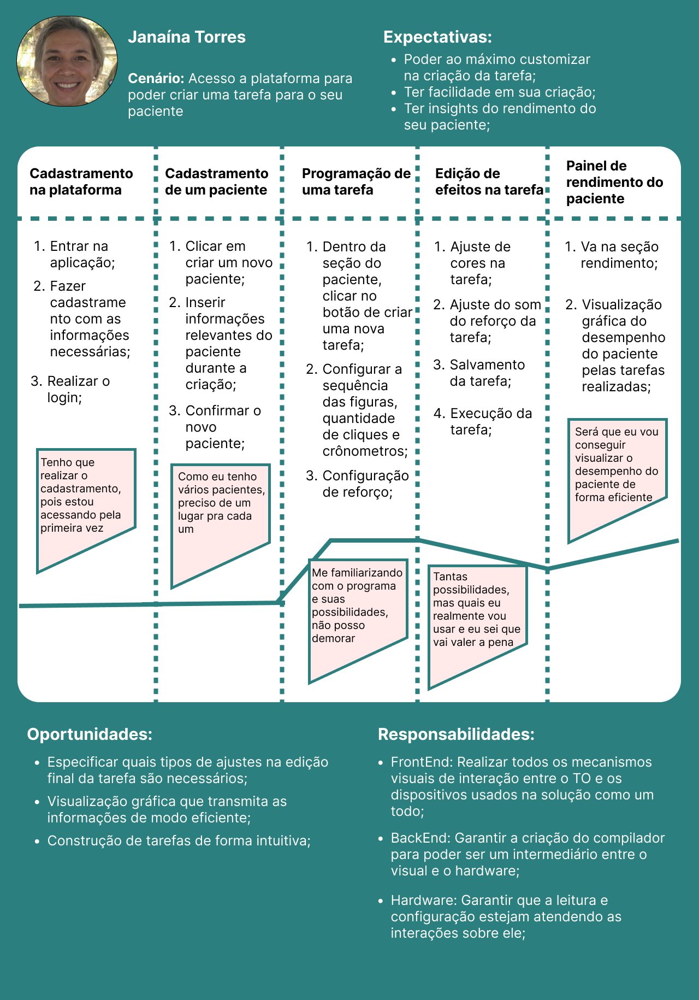
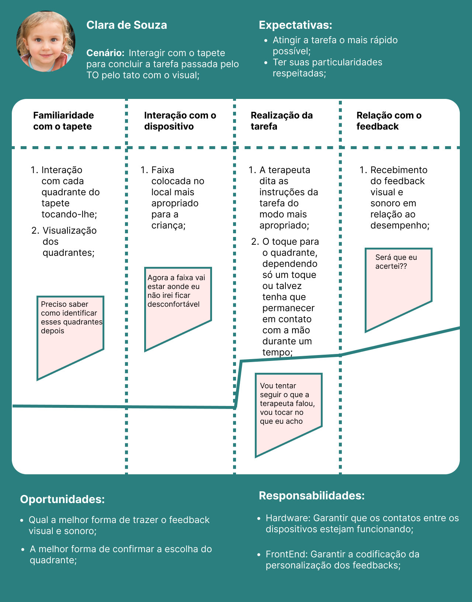
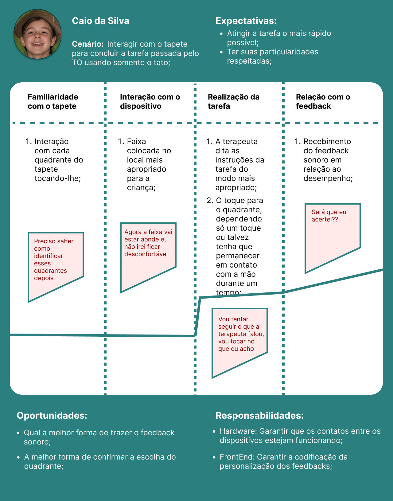

# Entendimento da Experiência do Usuário

## Personas
Personas são representações fictícias de segmentos específicos da audiência de um produto, serviço ou sistema. Elas são criadas para ajudar as equipes de design, marketing e desenvolvimento a compreender melhor e se conectar com os usuários reais ou potenciais. As personas são baseadas em dados demográficos, comportamentais, interesses e necessidades dos usuários, e frequentemente incluem informações como nome, idade, profissão, objetivos, desafios e preferências.

Ao criar personas, as equipes podem visualizar e compreender melhor para quem estão projetando ou criando algo. Isso ajuda a tomar decisões mais informadas ao desenvolver produtos ou serviços, adaptando-os para atender às necessidades e expectativas dos usuários específicos. Personas bem elaboradas permitem que as equipes se coloquem no lugar dos usuários e projetem soluções mais centradas no usuário. Isso pode levar a produtos mais eficazes e a uma melhor experiência do usuário. Sendo assim, foram criadas personas que se aliam com o escopo do projeto a fim de compreender e construir um produto que atenda as necessidades dos usuários do sistema progrmável que auxilia na reabilitação de crianças com parilisia cerebral.

### Persona 1 - Janaína Torres, a terapeuta ocupacional

### Persona 2 - Clara de Souza, a primeira paciente

### Persona 3 - Caio da Silva, o segundo paciente

## Mapa do jornada do usuário

Pontos de atenção:

- Cenário: Aborda o objetivo do usuário naquele momento ou, por assim dizer, a sua necessidade;

- Expectativas: O que o usuário irá ganhar com a aplicação;

- Oportunidades: Insights para melhorias futuras e pontos de atenção referente ao usuário;

- Responsabilidades: O que os desenvolvedores vão ter que fazer, qual a divisão de tarefas;

Observação: Vai haver marcação de sentimentos pela curva da linha;

### Jornada da terapeuta ocupacional

### Jornada da criança sem deficiência visual

### Jornada da criança com deficiência visual

## User stories
User stories (ou histórias de usuário) são uma técnica usada em desenvolvimento de software e gerenciamento de projetos ágeis para descrever requisitos de um sistema do ponto de vista do usuário. Elas são usadas para capturar funcionalidades, recursos ou necessidades do usuário em um formato conciso e compreensível. Aqui estão as user stories feitas para este projeto.

**Cadastramento**:

1. Como terapeuta ocupacional, quero poder cadastrar pacientes dentro da aplicação, para que eu possa acessar informações em relação a este futuramente.

2. Como terapeuta ocupacional, quero poder me cadastrar, para que eu possa entrar na aplicação.

**Laboratório**:

1. Como terapeuta ocupacional, quero poder ter um conjunto de ferramentas de blocos, para que eu possa codificar um sequenciamento destes, e assim, criar a tarefa.

2. Como terapeuta ocupacional, quero poder arrastar e soltar estes blocos sobre o sequenciamento, para que eu possa ter facilidade durante a criação.

3. Como terapeuta ocupacional, quero poder escolher o visual do feedback visual, para que o paciente tenha o reforço mais adequado.

4. Como terapeuta ocupacional, quero poder escolher o melhor efeito sonoro para o feedback, para que o paciente tenha o reforço mais adequado.

**Visualização de pacientes**:

1. Como terapeuta ocupacional, quero poder visualizar todos os pacientes, principalmente os últimos que atendi, para que eu possa me organizar diariamente.

2. Como terapeuta ocupacional, quero poder ver um perfil específico de um tal paciente, para que eu possa visualizar seu histórico.

**Desempenho**:

1. Como terapeuta ocupacional, quero poder visualizar o desempenho de um paciente em relação a uma tarefa específica, para que eu possa avaliar o seu número de acertos e tentativas.

2. Como terapeuta ocupacional, quero poder visualizar a comparação de acertos no decorrer de certo tempo de um conjunto de tarefas, para que eu possa ver qual tarefa melhor se encaixou para o paciente.

### Link das user stories modeladas em planilha
https://docs.google.com/spreadsheets/d/1eckR7Sk-Ui86WpM_nST6eb6EUdi4VLOvhxkbeRUNTpM/edit?usp=sharing

