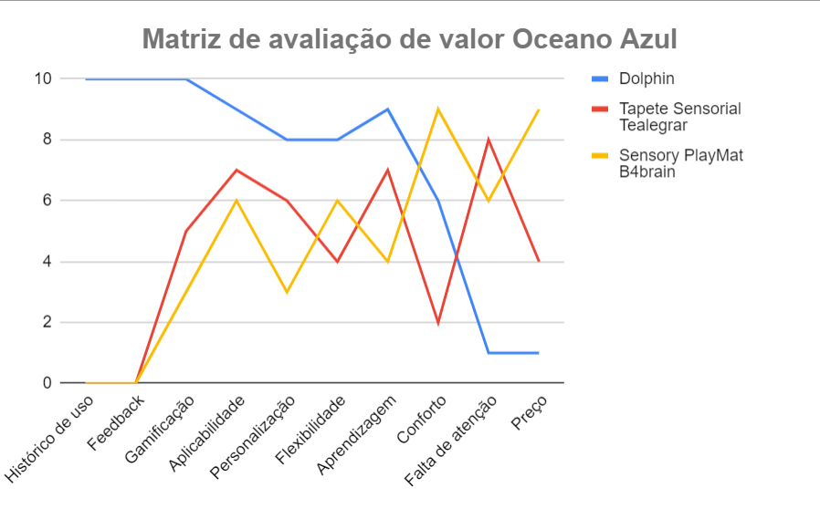

# Entendimento de negócio

## Matriz de Risco 

### **Ameaças:**

1. **Falha no treinamento de pessoal para uso da nova ferramenta.**
   - Justificativa: A eficácia do produto depende de uma operação correta.
   - Mitigação: Oferecer treinamento extensivo e materiais de apoio.

2. **Resistência ao uso da nova ferramenta por parte do pessoal.**
   - Justificativa: Mudanças podem enfrentar resistência inicial.
   - Mitigação: Demonstrar os benefícios claramente e envolver os funcionários no processo.

3. **Limitações tecnológicas na AACD.**
   - Justificativa: Dependência de infraestrutura tecnológica.
   - Mitigação: Avaliar a infraestrutura atual e adaptar o produto conforme necessário.

4. **Falha no acompanhamento e atualização do produto.**
   - Justificativa: Necessidade de manter o produto atualizado.
   - Mitigação: Estabelecer um canal direto de comunicação com a AACD.

5. **Expectativas não alinhadas entre as partes envolvidas.**
   - Justificativa: A compreensão clara das expectativas é crucial.
   - Mitigação: Comunicação transparente e feedbacks regulares.

6. **Dados sensíveis das crianças expostos acidentalmente.**
   - Justificativa: A proteção de dados é crucial.
   - Mitigação: Implementar sistemas de segurança robustos.

7. **Desatualização tecnológica da ferramenta ao longo do tempo.**
   - Justificativa: A tecnologia muda rapidamente.
   - Mitigação: Estabelecer atualizações periódicas.

8. **Dificuldade de integração com outros sistemas já existentes na AACD.**
   - Justificativa: Compatibilidade com sistemas antigos.
   - Mitigação: Análise técnica prévia e desenvolvimento de interfaces de integração.

9. **Desgaste físico ou mental nas crianças devido ao uso inadequado da ferramenta.**
   - Justificativa: O bem-estar das crianças é primordial.
   - Mitigação: Monitoramento constante e ajustes rápidos conforme feedback.

10. **Dificuldade em obter suporte técnico adequado após a implementação.**
   - Justificativa: A continuidade e eficácia da ferramenta dependem de suporte.
   - Mitigação: Estabelecer acordos de manutenção e suporte técnico.

11. **Expectativas não atendidas das crianças ou dos profissionais da AACD.**
   - Justificativa: Dissonância entre expectativa e realidade.
   - Mitigação: Comunicação clara e feedback constante.

12. **Problemas técnicos não antecipados durante o desenvolvimento.**
   - Justificativa: Desafios técnicos podem causar atrasos e exigir recursos adicionais.
   - Mitigação: Ter uma equipe técnica qualificada e preparada para resolver problemas rapidamente.

### **Oportunidades:**

1. **Aumento da eficácia dos tratamentos com a nova ferramenta.**
   - Justificativa: A principal meta do projeto.
   - Como aproveitar: Monitoramento constante e ajustes baseados no feedback.

2. **Capacitação e treinamento do pessoal da AACD.**
   - Justificativa: Pessoal capacitado pode melhorar a experiência das crianças.
   - Como aproveitar: Estabelecer parcerias de treinamento e workshops.

3. **Adaptação do produto para outras instituições similares no futuro.**
   - Justificativa: Expansão do impacto positivo.
   - Como aproveitar: Documentar o processo e estabelecer protocolos.

4. **Reconhecimento e apoio de parceiros e patrocinadores.**
   - Justificativa: Criação de uma rede de apoio.
   - Como aproveitar: Estratégia de comunicação e marketing.

5. **Desenvolvimento contínuo com base no feedback das crianças e profissionais.**
   - Justificativa: Melhorias contínuas baseadas em experiências reais.
   - Como aproveitar: Estabelecer canais de feedback e avaliações periódicas.

6. **Publicidade positiva para a AACD ao implementar tecnologia de ponta.**
   - Justificativa: Potencial de atrair mais apoiadores.
   - Como aproveitar: Estratégias de marketing e relações públicas.

10. **Criação de uma rede colaborativa entre AACD e outras instituições.**
   - Justificativa: Ampliação do impacto positivo.
   - Como aproveitar: Estabelecer parcerias e protocolos de cooperação.

7. **Receber feedbacks que podem inspirar novas soluções ou melhorias.**
   - Justificativa: O feedback é uma fonte rica de inovação.
   - Como aproveitar: Canais abertos e receptivos para sugestões.

8. **Possibilidade de criar um modelo replicável para outras instituições no mundo.**
   - Justificativa: Ampliação global do impacto positivo.
   - Como aproveitar: Documentação detalhada e estudos de caso.

9. **Integração com outras tecnologias emergentes (realidade virtual, por exemplo).**
   - Justificativa: O potencial da combinação de tecnologias.
   - Como aproveitar: Pesquisa e desenvolvimento contínuo.

10. **Desenvolvimento de novas habilidades e competências para a equipe da AACD.**
   - Justificativa: Capacitação contínua.
   - Como aproveitar: Treinamentos e workshops regulares.

11. **Expansão da ferramenta para atendimento remoto.**
   - Justificativa: A tendência crescente de telemedicina e atendimento à distância.
   - Como aproveitar: Investir em capacidades online e integração de plataformas.

## Análise Financeira do Projeto de Tapete Sensorial: Uma Perspectiva Detalhada
**1. Introdução:**  
Neste relatório, abordaremos a projeção dos custos para a concepção e desenvolvimento do tapete sensorial, integrado com funcionalidades tecnológicas. As projeções são para o período de um ano e buscam oferecer uma estimativa de investimento ao parceiro.

**2. Contextualização do Projeto:**  
A ideia central é a criação de um tapete com capacidades sensoriais aprimoradas, proporcionando benefícios terapêuticos aos usuários. A integração com a tecnologia é vista como um diferencial, potencializando suas capacidades.

**3. Detalhamento dos Custos Associados:**

3.1. **Tapete Sensorial Básico:**  
   - **Descrição:** Base física que serve como plataforma para a integração das soluções tecnológicas.
   - **Custo Unitário:** R$ 350,00.

3.2. **Pacote Greg Maker - Pacote 1:**  
   - **Descrição:** Kit tecnológico que traz inovações ao tapete.
      - **Cabos com Jacaré:** Proporcionam uma eficiente transmissão elétrica.
      - **Case de Proteção:** Garante segurança aos componentes eletrônicos, prevenindo danos.
      - **Cabo de Alimentação:** Assegura energia contínua para as operações.
      - **Placa Greg Maker:** Coração do sistema, responsável por processar e transmitir dados.
   - **Custo Unitário:** R$ 500,00.

3.3. **Fios Extras:**  
   - **Descrição:** Componentes adicionais que podem ser necessários conforme a expansão e complexidade do projeto.
   - **Custo Unitário:** R$ 10,00 por fio.

**4. Projeção de Investimento Total:**  
Para um protótipo inicial, o investimento projetado é de R$ 870,00. Contudo, é necessario alocar uma margem adicional para possíveis variações de preços e necessidades não previstas, totalizando, por precaução, uma projeção de R$ 1.000,00.

**5. Projeção de Receitas:**  
Em conformidade com os objetivos do projeto, que enfatizam a inovação e aplicação terapêutica, não se prevê geração de receitas. A iniciativa não visa lucro, mas sim a criação de valor essencial e benefícios à comunidade.

**6. Lógica das Estimativas:**  
A composição dos custos baseia-se nos preços correntes dos componentes e na visão técnica do projeto. A intenção é garantir um investimento que alie qualidade, inovação e eficiência, sempre priorizando o propósito central do tapete sensorial.

**7. Considerações Adicionais:**  
- A pesquisa e desenvolvimento contínuos podem introduzir necessidades financeiras adicionais.
- Recomenda-se revisões periódicas das estimativas, para manter alinhamento com a realidade de mercado e as necessidades do projeto.

**8. Conclusão:**  
Através desta análise financeira detalhada, delineamos um panorama completo e estruturado dos investimentos associados ao projeto do tapete sensorial. Reitera-se a importância de se manter atualizado quanto a variações de mercado e possíveis ajustes no escopo do projeto, assegurando que os recursos sejam alocados da forma mais eficiente possível.

## Total Addressable Market, Service Addressable Market e Service Obtainable Market
### Total Addressable Market
Total Addressable Market (TAM) é a oportunidade geral de receita disponível para um produto ou serviço se 100% de participação de mercado for alcançado. Por representar a oportunidade potencial, é frequentemente usado para determinar o nível de financiamento ou recursos que uma empresa deve investir em um novo produto ou linha de negócios.

A solução desenvolvida é considerada uma tecnologia assistiva, que é qualquer produto, instrumento, estratégia, serviço e prática, utilizado por pessoas com deficiência e pessoas idosas, especialmente produzido ou geralmente disponível para prevenir, compensar, aliviar ou neutralizar uma deficiência, incapacidade ou desvantagem e melhorar a autonomia, independência e qualidade de vida dos indivíduos (ISO 9999, 2007). Segundo o Coherent Market Insights estima-se que o tamanho do mercado global de tecnologia assistiva seja avaliado em US$ 22,98 bilhões em 2023.

### Service Addressable Market
Service Addressable Market (SAM) refere-se à seção do TAM que uma empresa pode atingir com seu modelo de negócios, representando uma fração de todo o mercado que uma empresa pode atingir com seus recursos limitados.

Considerando barreiras geográficas, limita-se o mercado para o Brasil. Segundo o Coherent Market Insights 20% do market share de tecnologias assistivas é representado pela América Latina, o que representa aproximadamente US$ 4,45 bilhões. De acordo com um estudo do Banco Mundial, em 2021 existiam cerca de 85 milhões de pessoas com deficiência na América Latina. Assim. tem-se uma média de US$ 52,35 por pessoa. Segundo o IBGE, 18,6 milhões de brasileiros possuem alguma deficiência (8.9% da população a partir de 2 anos de idade), ou seja, representa um mercado possível de US$ 973,71 milhões.

### Service Obtainable Market
Service Obtainable Market (SOM) é uma pequena seção no SAM que representa um mercado que uma empresa pode atingir de forma realista, tendo em vista que ela tem recursos limitados e opera em um mercado com empresas concorrentes.

A solução desenvolvida tem como foco inicialmente pessoas com paralisia cerebral e leves desordens neurológicas atendidas pela AACD. De acordo com o relatório integrado da própria AACD, em 2022 foram atendidos 59.167 pacientes. 44% da população atendida tem PC, o que equivale a aproximadamente 26.033 pacientes. Assim, com os mesmos US$ 52,35 por pessoa apresentado no SAM, teria-se um mercado mais realista de US$ 1.362.827,55.

### Diagrama resumo

## Canvas Proposta de Valor

## Matriz do Oceano Azul

| **Atributo**  | **Descrição** | 
|---------------------|------------------------------|
| **Histórico de Uso** | Nosso produto possui uma plataforma integrada a um banco de dados, onde são armazenados os testes realizados e criado um histórico personalizado para cada paciente. |
| **Feedback** | Durante a aplicação de um teste, a cada interação do paciente com o tapete, é emitido um feedback personalizável, para assim, informar ao paciente e ao terapeuta como o teste está indo. |
| **Gamificação** | Com o foco pensado em crianças, nossa plataforma é desenvolvida para que pareça um game, assim, sendo possível manter mais a atenção dos pacientes, e tornando o aprendizado mais divertido. Em comparação, os outros produtos tem como opção de gamificação apenas a criatividade do terapeuta para contar uma história, e a pontuação foi baseada no número de diferentes quadrantes nos tapetes. |
| **Aplicabilidade** | Seja para auxiliar no desenvolvimento de habilidades cognitivas, emocionais ou físicas, a flexibilidade de nossa solução permite que os jogos e feedbacks sejam adaptados a diferentes contextos terapêuticos. |
| **Personalização** | Nossa aplicação permite jogos e feedbacks personalizados. Eles podem ser modificados a qualquer momento utilizando linguagem no code. A personalização dos outros produtos se limita à hora da compra, onde é possível definir o que haverá em cada quadrante do tapete. |
| **Flexibilidade** | Nossa plataforma permite que terapeutas e cuidadores criem jogos e feedbacks personalizados de forma simples garantindo que as atividades possam ser adaptadas rapidamente, tendo opções de imagens, sons, cores e jogos, mantendo o estímulo e o interesse dos pacientes em constante evolução, e permitindo a aplicação para diferentes casos e cenários de pacientes. Em contrapartida, outros produtos se limitam a opções fixas no momento da compra e não oferecem margem para ajustes ao longo do tempo. |
| **Aprendizagem** | Com uma plataforma gamificada e feedbacks personalizados, o potencial de aprendizagem utilizando nosso produto é consideravelmente maior do que a de tapetes sensoriais tradicionais. Além de manter com mais facilidade a atenção do paciente, os feedbacks proporcionam uma resposta imediata de resultados. |
| **Conforto** | O design da plataforma foi pensado inteiramente para ser acessível e emana sensações de conforto. Utilizando cores bem aceitas, e arquiteturas simples, deixamos o ambiente de trabalho mais confortável. O Sensory PlayMat B4brain é feito de algodão, tornando-o altamente confortável também. |
| **Falta de Atenção** | Minha plataforma, repleta de imagens, sons e luzes, oferece uma experiência gamificada com feedbacks que naturalmente cativam a atenção dos pacientes. Em contrapartida, em outros tapetes sensoriais, a manutenção da atenção muitas vezes depende do envolvimento constante do terapeuta. |
| **Preço** | Produzido por desenvolvedores voluntários, nosso produto passa a custar muito menos que outros, possuindo apenas o custo dos materiais. Em comparação, o preço de compra do Tapete Sensorial Tealegrar é de R$459,90 e o preço do Sensory PlayMat B4brain é de R$2.899,00. |
